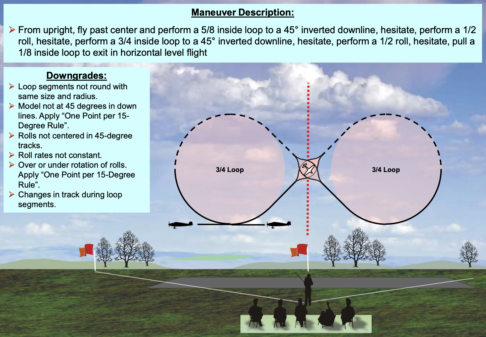

# Chapter 1: Introduction to F3A

**What is F3A?**  
F3A is a specific class of airplane model recognized by the FAI (Fédération Aéronautique Internationale), the governing body for air sports and aeronautic world records. It falls under the category of Radio-Controlled Precision Aerobatics, where pilots perform prescribed aerobatic maneuvers judged based on precision, accuracy, and execution.

**Where can I find F3A in the USA?**  
F3A, also known as "RC pattern aerobatics" in the USA, is flown by the NSRCA (National Society of Radio Controlled Aerobatics), a special interest group within the AMA (Academy of Model Aeronautics). The NSRCA is responsible for promoting and organizing radio-controlled aerobatic flying events and competitions. For the latest information, visit the NSRCA website (nsrca.us) or check out the AMA's website section on [special interest groups](https://www.modelaircraft.org/about-ama/ama-organization/special-interest-groups).

**Is there an official "F3A Club"?**  
No. At the time of this writing, there is no dedicated "F3A Club" as such. To find specific F3A events organized by NSRCA in the USA, visit the NSRCA website and check their [events calendar](https://nsrca.us/index.php/eventsnewmenu/list-events). Additionally, you can reach out to local aeromodeling clubs in your area that partner with NSRCA to inquire about upcoming F3A events. Please note that event schedules and locations can change, so it's best to regularly check the NSRCA website or get in touch with local clubs for the most up-to-date information on F3A events.

## 1.0.1 Get a simple foam plane with a good power system 

Your RC plane must have enough power to fly a vertical line perpendicular to the horizon.

- NSRCA website recommends a foam plane from FMS [F3A Olympus 1400mm](https://www.horizonhobby.com/product/f3a-olympus-pnp-1400mm/FMM067P2.html)
- Many people already have powerful foamy from E-Flite [Timber X 1.2m](https://www.horizonhobby.com/product/timber-x-1.2m-pnp/EFL3875.html)
- There are good profile ARFs from Twisted Hobbies [42-48" Airfoil Series](https://twistedhobbys.com/airplanes/3d-monoplanes/42-48-airfoild-series/) with [Power Combo 42-48"](https://twistedhobbys.com/power-combo-42-48-mono-models/)
- Some people like it 3D-printable like [Notos 1300mm (51")](https://www.planeprint.com/notos)

With one of the above planes or any other that you have, practice flying the figure **Cuban 8** as follows:

It does not have to be perfect. If you enjoyed the exercise, you are ready to take a stab at a complete sequence in the next section and make it perfect.

## 1.0.2 Fly a sequence with a simple foam plane

To gain practice and confidence, start flying your sequence (pattern) with a simple foam plane. Once you have mastered the maneuvers using the foam plane, it is safer to transition to a 2-meter F3A competition plane for more advanced flying.

CIAM is the FAI Aeromodelling Commission that oversees aeromodelling activities worldwide. Aspiring F3A pilots should visit [CIAM's official web page](https://www.fai.org/page/f3-aerobatics-training-material-judges) or contact their country's organizations affiliated with CIAM to access training material.

To find the simplified (AMA) and official (F3A) flying sequences, pilots can follow these steps on the NSRCA website:

1. Study the Sportsman sequence in [PowerPoint Presentations](https://nsrca.us/index.php/flying/sequences/powerpoints)
2. Print the [Sportsman Call sheet](https://nsrca.us/index.php/flying/sequences/call-sheets-and-aresti/sportsman-call-sheet) for reference
3. Watch videos posted on the NSRCA website

Keep in mind that the NSRCA website may undergo updates and changes, so it's essential to regularly check for the most current information on events and flying sequences. Additionally, if you have any questions or need assistance, you can reach out to event organizers or fellow aerobatic enthusiasts in your local aeromodelling community or club affiliated with NSRCA. They can provide guidance, advice, and support as you embark on your journey as an F3A aerobatics pilot.

## 1.0.3 Get a real 2-meter long F3A model plane

To buy it new or to get a DIY design, you can check these resources:

- [AJ Aircraft 2m Acuity](https://www.aj-aircraft.com/2m-acuity.html)
- [Extreme Flight 2m Vanquish](https://extremeflightrc.com/2M-Vanquish-RedWhiteYellow_p_7664.html)
- [F3A Unlimited imported Pattern Planes](https://www.f3aunlimited.com/airplanes/f3a-aircraft)
- [Insight RC balsa DIY](http://www.insightrc.com/insightrc-f3a-aircraft.html)
- [Open Source F3A Biplane](https://www.facebook.com/groups/660663817886159/)
- Suggest a link to another 2 meter F3A model

If you're considering your first 2-meter long F3A model, buying a second-hand plane can be an excellent option. Follow these steps to make a safe purchase:

1. **Research and Decide**: Familiarize yourself with F3A model planes and their specifications. Decide on the specific features you want.

2. **Online Marketplaces**: Check eBay, Craigslist, RC forums, or specialized RC trading websites for used F3A model planes.

3. **Local RC Clubs**: Visit local RC flying clubs or model aircraft events to find potential sellers.

4. **RC Classifieds**: Look for RC classified ads in hobby magazines or websites catering to RC enthusiasts.

5. **Social Media Groups**: Join RC-related social media groups or forums where members might post items for sale.

6. **Contact Sellers**: Reach out to sellers of used F3A model planes, inquire about the plane's condition, history, and request pictures.

7. **Inspect and Verify**: If buying locally, meet the seller to inspect the plane for any damages or wear.

8. **Negotiate and Finalize**: Negotiate the price based on the plane's condition and finalize the deal if both parties agree.

9. **Shipping or Pickup**: For non-local purchases, discuss safe shipping options with the seller.

10. **Be Cautious**: Exercise caution when buying used RC model planes and trust the seller. Ask for references or feedback if possible.

Remember, F3A model planes can be valuable, so take your time to find the right one that fits your needs and budget. Inspect thoroughly, ask questions, and ensure a smooth transaction before making the purchase. 

Happy flying!

## 1.0.4 F3A book authors on Amazon

- [David Scott](https://www.amazon.com/stores/David-Scott/author/B004UO1QJG)
- [Peter J Jenkins](https://www.amazon.com/stores/Peter-J-Jenkins/author/B0916KQ62Y)
